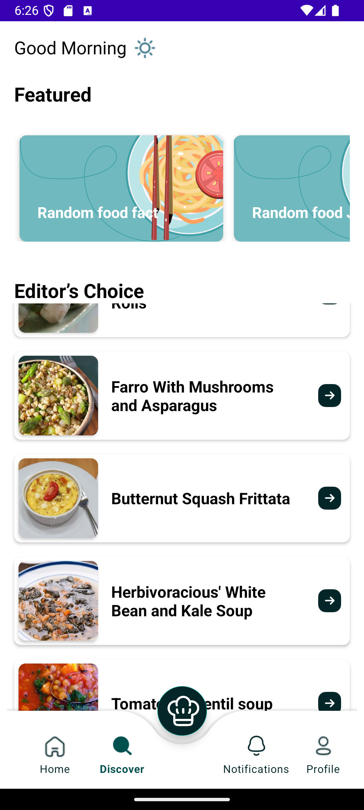
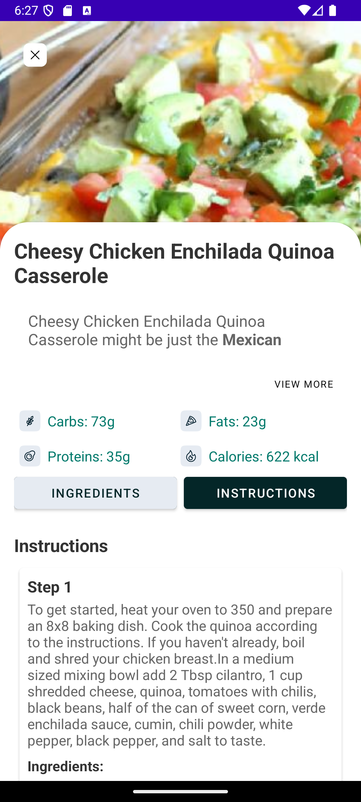

# RecipeApp

RecipeApp — это Android-приложение на Java, которое позволяет пользователям находить и просматривать рецепты. Приложение поддерживает категории блюд, детализированное описание рецептов и сохранение избранных рецептов.

## Функционал

- Поиск рецептов по категориям (завтрак, обед, ужин и др.)
- Просмотр полной информации о рецептах:
    - Название рецепта
    - Время приготовления
    - Список ингредиентов (с указанием количества и единиц измерения)
    - Пошаговые инструкции по приготовлению
    - Питательная информация, если доступна
- Поддержка изображений и видео для рецептов
- Рандомные шутки и факты о еде

## Технологии

- **Язык программирования**: Java
- **Платформа**: Android
- **Архитектура**: MVVM (Model-View-ViewModel)
- **Сетевые запросы**: Retrofit
- **Асинхронная обработка данных**: Coroutines
- **Парсинг JSON**: Gson

## Установка

1. Клонируйте репозиторий:

    ```bash
    git clone https://github.com/Just0Lina/4th-course-android.git
    ```

2. Откройте проект в **Android Studio**.

3. Настройте API:
    - Зарегистрируйтесь на [Spoonacular API](https://spoonacular.com/) и получите ключ.
    - Добавьте API ключ в `gradle.properties`:
      ```properties
      API_KEY="ваш_ключ"
      ```

4. Синхронизируйте проект, чтобы загрузить все зависимости.

## Запуск

- Запустите приложение на эмуляторе или реальном устройстве через Android Studio.
- Убедитесь, что устройство подключено к интернету для доступа к API.

## Скриншоты

*Добавьте сюда скриншоты приложения для иллюстрации интерфейса.*

## Скриншоты






## Видео-демонстрация


## Требования

- **Android 5.0** и выше
- **Интернет-соединение** для загрузки данных рецептов
